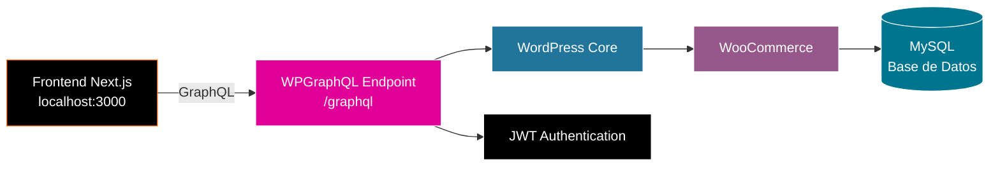

<div align="center">

# 📝 NexoPC Backend

### WordPress + WooCommerce + GraphQL

Backend headless de NexoPC. Expone la API GraphQL para que el frontend Next.js pueda consumir productos, pedidos y usuarios.

[](https://wordpress.org/)
[](https://woocommerce.com/)
[](https://www.wpgraphql.com/)
[](https://www.php.net/)
[](https://www.mysql.com/)

**Universidad Privada del Norte** · Curso: E-Business y Analítica Web · Trujillo, Perú · 2026

</div>

---

## 📖 Tabla de Contenidos

- [Descripción General](#-descripción-general)
- [Stack Tecnológico](#-stack-tecnológico)
- [Arquitectura del Sistema](#-arquitectura-del-sistema)
- [Requisitos Previos](#-requisitos-previos)
- [Instalación Paso a Paso](#-instalación-paso-a-paso)
- [Configuración de CORS (mu-plugin)](#-configuración-de-cors-mu-plugin)
- [Generar Claves API de WooCommerce](#-generar-claves-api-de-woocommerce)
- [Configuración de Envíos y Pagos](#-configuración-de-envíos-y-pagos)
- [Importar Productos de Prueba](#-importar-productos-de-prueba)
- [Verificar que GraphQL Funciona](#-verificar-que-graphql-funciona)
- [Plugins Instalados](#-plugins-instalados)
- [Estructura del Proyecto](#-estructura-del-proyecto)
- [Flujo de Trabajo con Git](#-flujo-de-trabajo-con-git)
- [Solución de Problemas](#-solución-de-problemas)
- [Equipo y Contacto](#-equipo-y-contacto)

---

## 🎯 Descripción General

**NexoPC Backend** es el motor de e-commerce headless del proyecto NexoPC. Está construido sobre **WordPress + WooCommerce** y expone sus datos a través de una **API GraphQL** consumida por el frontend en Next.js.

### ¿Qué provee?

| Servicio | Descripción |
|----------|-------------|
| 📦 **Catálogo de productos** | CPUs, GPUs, placas madre, RAM, almacenamiento, fuentes, gabinetes. |
| 🛒 **Pedidos** | Creación y gestión de órdenes vía REST API. |
| 👥 **Usuarios** | Autenticación con JWT para clientes. |
| 🔐 **Autenticación** | JWT tokens para endpoints protegidos. |
| 🌐 **API GraphQL** | Endpoint en `/graphql` con todos los tipos de WooCommerce. |

### ¿Por qué WordPress como backend?

- ✅ **Motor de e-commerce completo:** carrito, pedidos, inventario, cupones.
- ✅ **Panel de administración robusto:** gestión visual de productos.
- ✅ **Plugins de GraphQL:** exposición de datos sin programar.
- ✅ **Comunidad enorme:** documentación y soporte disponibles.

---

## 🛠️ Stack Tecnológico

| Tecnología | Versión | Propósito |
|------------|---------|-----------|
| **WordPress** | 7.1.1 | CMS base |
| **WooCommerce** | 11.1.1 | Motor de e-commerce |
| **WPGraphQL** | 2.23.0 | API GraphQL |
| **WooGraphQL** | 0.21.2 | Extensión GraphQL para WooCommerce |
| **JWT Authentication** | 1.5.0 | Autenticación de usuarios |
| **PHP** | 8.2.29 | Lenguaje backend |
| **MySQL** | 8.4.0 | Base de datos |
| **LocalWP** | Última | Servidor local |

---

## 🏗️ Arquitectura del Sistema



### Endpoints principales

| Endpoint | Método | Propósito |
|----------|--------|-----------|
| `/graphql` | POST | Consultas GraphQL (productos, pedidos, usuarios) |
| `/wp-json/wp/v2/*` | REST | REST API estándar de WordPress |
| `/wp-json/wc/v3/*` | REST | REST API de WooCommerce (pedidos) |
| `/wp-json/jwt-auth/v1/token` | POST | Autenticación JWT |

---

## 📋 Requisitos Previos

| Herramienta | Versión | Cómo verificar |
|-------------|---------|----------------|
| **LocalWP** | Última | Descargar de [localwp.com](https://localwp.com/) |
| **Node.js** | 20+ | `node --version` |
| **Git** | 2.x | `git --version` |
| **Navegador** | Chrome/Firefox | Para acceder al panel de WordPress |

---

## 🚀 Instalación Paso a Paso

### 1. Instalar LocalWP y crear el sitio

1. Descarga e instala **LocalWP**.
2. Crea un nuevo sitio:
   - **Nombre:** `nexopc-local`
   - **Dominio:** `nexopc-local.local`
   - **Web server:** nginx
   - **PHP:** 8.2.x
   - **Database:** MySQL 8.x
   - **WordPress:** Última versión
   - **Usuario:** `admin`
   - **Contraseña:** (la que definas)

### 2. Instalar WordPress y WooCommerce

1. Accede a `http://nexopc-local.local/wp-admin`.
2. Sigue el asistente de instalación.
3. Ve a **Plugins → Añadir nuevo** → busca **WooCommerce** → Instala y activa.
4. Configura WooCommerce:
   - **País:** Perú — La Libertad
   - **Moneda:** Soles (S/)
   - **Tipo de producto:** Electrónica y ordenadores

### 3. Instalar los plugins de GraphQL

Instala y activa **en este orden**:

| # | Plugin | Cómo instalarlo | Versión |
|---|--------|-----------------|---------|
| 1 | **WPGraphQL** | Plugins → Añadir nuevo → buscar "WPGraphQL" | 2.23.0+ |
| 2 | **WPGraphQL for WooCommerce (WooGraphQL)** | Descargar desde https://github.com/wp-graphql/wp-graphql-woocommerce/releases → Subir plugin | 0.21.2+ |
| 3 | **JWT Authentication for WP REST API** | Plugins → Añadir nuevo → buscar "JWT Authentication" | 1.5.0+ |

> ⚠️ **NO instalar "GraphQL for eCommerce"** (plugin antiguo, incompatible).

### 4. Configurar HPOS (CRÍTICO)

**WooGraphQL NO funciona con HPOS activo.** Debes desactivarlo:

1. Ve a **WooCommerce → Ajustes → Avanzado → Características**.
2. En **"Almacenamiento de datos de pedidos"**, selecciona:
   - ✅ **"Almacenamiento de entradas de WordPress (heredado)"**
   - ❌ Desmarca **"Almacenamiento de pedidos de alto rendimiento (HPOS)"**
3. Desmarca **"Activar el modo de compatibilidad"**.
4. Guarda.

### 5. Configurar JWT Authentication

1. Ve a **Ajustes → JWT Authentication**.
2. Haz clic en **"Generate New Key"**.
3. Copia el código generado.
4. Abre `wp-config.php` y pega el código **antes** de `/* That's all, stop editing! */`:

```php
define('JWT_AUTH_SECRET_KEY', 'tu-clave-generada-aqui');
define('JWT_AUTH_CORS_ENABLE', true);
```

5. Guarda y reinicia LocalWP.
6. Verifica que la pantalla de JWT Authentication esté **toda en verde** (✅).

---

## 🌐 Configuración de CORS (mu-plugin)

Para que el frontend (`localhost:3000`) pueda consumir la API, el backend debe permitir CORS. El repositorio incluye un **mu-plugin** que lo hace automáticamente.

### Verificar que esté activo

1. Ve a `http://nexopc-local.local/wp-admin/plugins.php?plugin_status=mustuse`.
2. Debe aparecer **"NexoPC CORS"** en la lista.

### Si no aparece, créalo manualmente

1. Crea la carpeta `wp-content/mu-plugins/` si no existe.
2. Crea el archivo `wp-content/mu-plugins/nexopc-cors.php` con:

```php
<?php
/**
 * Plugin Name: NexoPC CORS
 * Description: Habilita CORS para el frontend headless de NexoPC.
 * Version: 1.0.0
 * Author: Equipo NexoPC
 */

if (!defined('ABSPATH')) {
    exit;
}

add_action('init', function () {
    header("Access-Control-Allow-Origin: http://localhost:3000");
    header("Access-Control-Allow-Methods: GET, POST, OPTIONS, PUT, DELETE");
    header("Access-Control-Allow-Headers: Content-Type, Authorization, X-Requested-With");
    header("Access-Control-Allow-Credentials: true");
    
    if ($_SERVER['REQUEST_METHOD'] === 'OPTIONS') {
        status_header(200);
        exit();
    }
}, 15);
```

3. Reinicia LocalWP.

---

## 🔑 Generar Claves API de WooCommerce

**Solo el líder del equipo** las genera (una sola vez). Los demás las reciben por canal seguro.

1. Ve a **WooCommerce → Ajustes → Avanzado → REST API**.
2. Clic en **"Añadir clave"**.
3. Configura:
   - **Descripción:** `Headless Frontend`
   - **Usuario:** `admin`
   - **Permisos:** **Lectura/Escritura**
4. Clic en **"Generar clave API"**.
5. **Copia inmediatamente:**
   - `Consumer Key` (`ck_...`)
   - `Consumer Secret` (`cs_...`)
6. **Compártelas con el equipo por canal seguro** (1Password, Bitwarden, DM de GitHub).

> ⚠️ **Estas claves solo se muestran una vez.** Si las pierdes, genera un nuevo par.

---

## 🚚 Configuración de Envíos y Pagos

### Envíos

Ve a **WooCommerce → Ajustes → Envío** y crea:

| Zona | Región | Costo |
|------|--------|-------|
| **La Libertad** | La Libertad, Perú | S/ 0.00 |
| **Resto del Perú** | Perú | S/ 25.00 |

### Métodos de pago

Ve a **WooCommerce → Ajustes → Pagos** y activa solo:

- ✅ **Transferencia bancaria directa (BACS)**
- ✅ **Contra reembolso (COD)**

> 💡 Aunque el pago real se procesará con **Culqi** desde el frontend, WooCommerce necesita un método activo para crear órdenes vía REST API.

---

## 📦 Importar Productos de Prueba

Para que todos los desarrolladores tengan el mismo set de productos:

### Opción A: Importar desde CSV

1. Ve a **WooCommerce → Productos → Importar**.
2. Sube el archivo `data/productos.csv` (si existe en el repositorio).
3. Mapea las columnas.
4. Clic en **"Ejecutar el importador"**.

### Opción B: Crear productos manualmente

Set mínimo recomendado (3 por categoría):

**Categorías:**
- Procesadores, Placas Madre, Memoria RAM, Tarjetas Gráficas, Almacenamiento, Fuentes de Poder, Gabinetes.

**Atributos:**
- Socket (AM4, AM5, LGA1700), Tipo de RAM (DDR4, DDR5), Formato (ATX, Micro-ATX), TDP, Vatios, Longitud GPU, Marca.

**Productos sugeridos:**

| Categoría | Productos |
|-----------|-----------|
| Procesadores | AMD Ryzen 5 7600, Ryzen 7 7700X, Intel i5-13400F |
| Placas Madre | ASUS B650M-A, MSI B760M-A, Gigabyte X670 |
| Memoria RAM | Kingston DDR5 16GB, Corsair DDR5 32GB, Kingston DDR4 16GB |
| Tarjetas Gráficas | ASUS RTX 4060, MSI RTX 4070, Gigabyte RTX 4090 |
| Almacenamiento | Kingston NV2 1TB, Samsung 980 Pro 2TB, Seagate 2TB HDD |
| Fuentes | EVGA 650W, Corsair 750W, Seasonic 1000W |
| Gabinetes | NZXT H510, Cooler Master Q300L, Lian Li O11 |

---

## 🧪 Verificar que GraphQL Funciona

### Test 1: Endpoint responde

Abre en el navegador:
```
http://nexopc-local.local/graphql
```

Debe responder con un mensaje JSON (no un error 404).

### Test 2: Consulta de productos

Abre el **GraphQL IDE**:
```
http://nexopc-local.local/wp-admin/admin.php?page=graphql-ide
```

Ejecuta:

```graphql
{
  products(first: 5) {
    nodes {
      id
      name
      slug
      ... on SimpleProduct {
        price
        stockStatus
      }
    }
  }
}
```

**Resultado esperado:** Un JSON con tus productos.

### Test 3: Consulta de categorías

```graphql
{
  productCategories {
    nodes {
      name
      slug
    }
  }
}
```

---

## 🔌 Plugins Instalados

| Plugin | Estado | Propósito |
|--------|--------|-----------|
| **WooCommerce** | ✅ Activo | Motor de e-commerce |
| **WPGraphQL** | ✅ Activo | API GraphQL |
| **WPGraphQL for WooCommerce** | ✅ Activo | Extensión WooCommerce |
| **JWT Authentication** | ✅ Activo | Autenticación de usuarios |
| **NexoPC CORS (mu-plugin)** | ✅ Activo | CORS para el frontend |
| Google for WooCommerce | ❌ Inactivo | No se usa |
| Jetpack | ❌ Inactivo | No se usa |
| MailPoet | ❌ Inactivo | No se usa |
| Reddit for WooCommerce | ❌ Inactivo | No se usa |
| Snapchat for WooCommerce | ❌ Inactivo | No se usa |
| Visa Acceptance Solutions | ❌ Inactivo | No se usa |
| WooCommerce PayPal Payments | ❌ Inactivo | No se usa |

---

## 📁 Estructura del Proyecto

```
nexopc-backend/
├── wp-admin/                         # ❌ NO versionado (core de WP)
├── wp-includes/                      # ❌ NO versionado (core de WP)
├── wp-content/
│   ├── mu-plugins/
│   │   └── nexopc-cors.php           # ✅ CORS personalizado
│   ├── plugins/                      # ❌ Se reinstalan desde README
│   ├── themes/                       # ❌ Se reinstalan desde README
│   ├── uploads/                      # ❌ Imágenes no versionadas
│   ├── languages/                    # ❌ No versionado
│   └── index.php                     # ❌ No versionado
├── wp-config-sample.php              # ✅ Plantilla de configuración
├── .gitignore                        # ✅ Reglas de exclusión
└── README.md                         # ✅ Este archivo
```

**¿Por qué no se sube todo?**

- WordPress core se puede reinstalar.
- Los plugins se reinstalan desde el README.
- Las imágenes pesan mucho y son específicas de cada instalación.
- `wp-config.php` contiene credenciales sensibles.

---

## 🌳 Flujo de Trabajo con Git

### Antes de empezar a trabajar

```bash
git pull origin main
```

### Verificar que solo se versionen los archivos correctos

```bash
git status -u
```

Debe mostrar solo:
- `.gitignore`
- `README.md`
- `wp-config-sample.php`
- `wp-content/mu-plugins/nexopc-cors.php`

**⚠️ NO debe mostrar** `wp-admin/`, `wp-includes/`, `wp-config.php`, plugins, etc.

### Crear una rama para tu funcionalidad

```bash
git checkout -b feat/nombre-de-tu-tarea
```

### Guardar cambios

```bash
git add .
git commit -m "feat: descripción del cambio"
git push origin feat/nombre-de-tu-tarea
```

---

## 🐛 Solución de Problemas

### Error: "Cannot query field products on type RootQuery"

**Causa:** WooGraphQL no está activo o el esquema no está reconstruido.

**Solución:**
1. Ve a **Plugins** y verifica que WooGraphQL esté activo.
2. Desactiva y reactiva WPGraphQL (esto limpia el caché del esquema).
3. Verifica que HPOS esté desactivado (Paso 4).

### Error: "Cannot query field price on type ProductUnion"

**Causa:** Estás consultando el precio sin inline fragment.

**Solución:** Usa inline fragments en tu query:

```graphql
{
  products(first: 5) {
    nodes {
      name
      slug
      ... on SimpleProduct {
        price
        stockStatus
      }
      ... on VariableProduct {
        price
        stockStatus
      }
    }
  }
}
```

### Error: "CORS policy: No 'Access-Control-Allow-Origin' header"

**Causa:** El mu-plugin `nexopc-cors.php` no está activo.

**Solución:**
1. Verifica en `http://nexopc-local.local/wp-admin/plugins.php?plugin_status=mustuse`.
2. Si no aparece, créalo manualmente (ver sección de CORS arriba).
3. Reinicia LocalWP.

### Error: "Gutenberg/HPOS incompatibility"

**Causa:** WooCommerce usa HPOS por defecto, que es incompatible con WooGraphQL.

**Solución:** Desactivar HPOS (Paso 4).

### Error: "JWT Authentication: Needs Attention"

**Causa:** No has generado la clave JWT.

**Solución:**
1. Ve a **Ajustes → JWT Authentication**.
2. Clic en **"Generate New Key"**.
3. Copia el código y pégalo en `wp-config.php`.
4. Reinicia LocalWP.

### Los productos no aparecen en el frontend

1. Verifica que el backend esté corriendo (LocalWP iniciado).
2. Verifica que WooGraphQL esté activo.
3. Verifica que HPOS esté desactivado.
4. Verifica que tengas al menos 1 producto en WooCommerce.
5. Ejecuta la query de prueba en el GraphQL IDE.

---

## 🗺️ Roadmap del Backend

### ✅ Completado
- [x] WordPress + WooCommerce instalados
- [x] WPGraphQL + WooGraphQL + JWT Auth
- [x] HPOS desactivado
- [x] Mu-plugin CORS
- [x] Categorías y atributos definidos

### 🚧 En desarrollo
- [ ] Set completo de productos (21 productos)
- [ ] Configuración de envíos
- [ ] Configuración de pagos (BACS + COD)
- [ ] Exportación de productos a CSV

### 📋 Futuro
- [ ] Integración con Culqi (vía REST API)
- [ ] Cupones y descuentos
- [ ] Programa de suscripciones
- [ ] Deploy a hosting de producción

---

## 📞 Contacto

### Equipo

| Nombre | Rol | GitHub |
|--------|-----|--------|
| Marco Gamez Monzon | Líder / Frontend | [@marcoGamez](#) |
| Hiroshi Icochea Calderon | Backend / WordPress | [@hiroshi](#) |
| Kevin Ventura Gastulo | Analítica Web / QA | [@kevin](#) |

### Información del curso

- **Universidad:** Universidad Privada del Norte (UPN)
- **Facultad:** Ingeniería
- **Carrera:** Ingeniería de Sistemas Computacionales
- **Curso:** E-Business y Analítica Web
- **Docente:** Mg. María Li Fernández
- **Ciclo:** 10°
- **Periodo:** 2026-2

### Repositorios

- **Frontend:** https://github.com/xWrkz/NexoPC
- **Backend (este):** https://github.com/xWrkz/nexopc-backend

### Contacto

- 📧 Email: [contacto.nexopc@gmail.com](mailto:contacto.nexopc@gmail.com)
- 📍 Ubicación: Trujillo, La Libertad, Perú

---

<div align="center">

**Hecho con ❤️ en Trujillo, Perú**

⭐ Si te gusta este proyecto, dale una estrella en GitHub ⭐

</div>